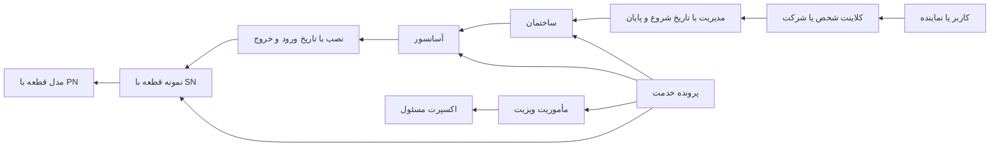

# مدل بیزینس سان اپ

سان اپ عملیات خدمات آسانسور شرکت بهسان آریان، به‌ویژه خدمات برد، را مدیریت می‌کند. این سند مدل هدف بر اساس توضیح مالک محصول را از ساختار فعلی کد جدا می‌کند. تغییر مدل نیازمند مهاجرت و تطبیق داده است.

## اشخاص و دارایی‌ها

| مفهوم | مدل مورد نیاز |
| --- | --- |
| کلاینت | شخص مدیر ساختمان یا شرکت پیمانکار؛ با حساب کاربری یکی نیست و ممکن است چند نماینده داشته باشد |
| مدیریت ساختمان | ارتباط کلاینت و ساختمان با شروع، پایان، مسئول ثبت و علت انتقال؛ تاریخچه حفظ شود |
| ساختمان و مجموعه | مجموعه ممکن است چند ساختمان داشته باشد؛ خود ساختمان هم آسانسور دارد، حتی بدون فرزند |
| آسانسور | هویت مستقل، ساختمان محل نصب، مشخصات فنی، وضعیت و سوابق خدمات |
| مدل قطعه | سازنده، خانواده، مدل، PN و revision؛ PN الزاماً شناسه یکتای نمونه فیزیکی نیست |
| نمونه قطعه | نمونه فیزیکی با SN در صورت وجود، وضعیت، مالکیت و تاریخچه؛ قطعات هم‌مدل نمونه یکسان نیستند |
| نصب قطعه | ارتباط زمان‌دار نمونه با آسانسور، ورود و خروج، مسئول و پرونده خدمت |
| اکسپرت | نیروی شرکت با مهارت و مأموریت؛ تنها دارایی‌ها و مأموریت‌های مجاز را ببیند |

## مدیریت در طول زمان

ساختمان می‌تواند امروز تحت مدیریت کلاینت ۱ و سال بعد تحت مدیریت کلاینت ۲ باشد. جایگزینی ساده شناسه کلاینت، تاریخچه را از بین می‌برد. رابطه مدیریت باید بازه زمانی و ثبت تغییر داشته باشد؛ هم‌پوشانی مدیر اصلی و دسترسی نمایندگان طبق تصمیم بیزینس اعتبارسنجی می‌شود.

گزارش گذشته باید اطلاعات کلاینت و دارایی زمان ارائه خدمت را حفظ کند. دسترسی مدیر قبلی به تاریخچه، سیاست جداگانه و هنوز نیازمند تصمیم مالک محصول است. انتقال مدیریت نباید مجوز دیدن تمام اطلاعات مدیر جدید ایجاد کند.

## چرخه خدمت پیشنهادی

درخواست کلاینت یا برنامه دوره‌ای ← بررسی نوع، اولویت و پوشش ← انتخاب ساختمان و آسانسور یا قطعه ← زمان‌بندی و تخصیص اکسپرت ← انجام کار و ثبت شواهد ← بررسی گزارش و اصلاح در صورت رد ← تأیید فنی ← تحویل نتیجه به کلاینت ← پیگیری و بستن پرونده.

این گردش باید لغو، تعویق، عدم دسترسی، انتظار قطعه، تغییر کارشناس، مراجعه مجدد و خرابی تکراری را پشتیبانی کند. هر انتقال وضعیت، زمان و عامل دارد. ثبت پاسخ یا مصرف قطعه با retry نباید تکرار شود.

پشتیبانی تلفنی ممکن است بدون اعزام تمام شود، اما باید دارایی، مشکل، توصیه، نتیجه و نیاز به اعزام ثبت شود. تعمیر برد علاوه بر ویزیت، دریافت، تشخیص، کارگاه، آزمون، تحویل و احتمال برد امانی دارد. گارانتی تصمیم پوشش و دلیل آن را نگه می‌دارد.

## گزارش و تأیید

قالب پرسشنامه نسخه‌بندی می‌شود. سؤال، پاسخ، عکس و نتیجه به دارایی مربوط متصل است. ویزیت چند آسانسور نباید یک پاسخ مشترک مبهم داشته باشد. صفر و false به معنی نبود پاسخ نیستند. شروط ایمنی و حداقل شواهد روی سرور بررسی می‌شوند.

تأیید فنی گزارش، تأیید هزینه و تأیید دریافت توسط مشتری سه عمل متفاوت‌اند. گزارش تأییدشده ثابت می‌ماند؛ اصلاح بعدی با نسخه یا رویداد قابل ردیابی انجام می‌شود.

## نقش‌ها و اپ‌ها

- ادمین و برنامه‌ریز: مدیریت شرکت و برنامه، کاربران، داده، بررسی گزارش و گردش تخصصی طبق مجوز.
- سرپرست: تخصیص و بررسی مأموریت در محدوده مسئولیت.
- اکسپرت: مأموریت‌ها، گزارش، عکس، قطعات و درخواست کمک.
- کلاینت و نماینده: ساختمان‌ها و دارایی‌های مجاز، درخواست، موعد، گزارش، قرارداد و پشتیبانی.

یک حساب ممکن است چند نقش داشته باشد. اپ مشترک field با منوی بک‌اند و قابلیت‌های واقعی نقش، تجربه مناسب هر نقش را نشان می‌دهد. مجوز رکورد در API اعمال می‌شود. نقش کامل محلی برای مشاهده و آزمون است و الگوی عمومی دسترسی کاربران نیست.

## مواردی که هنوز مدل هدف نیستند

### وضعیت قابل اجرا پس از بسته دوم

Client، Building، Elevator، Product و ProductModel اکنون پروژه مشخص دارند؛ legacy بدون پروژه یا شاهد یکتا از API دارایی خارج می‌ماند. `Role.asset_scope` دامنه را صریح می‌کند و grant متد همان مسیر نیز الزامی است. دامنه client به UserClient و BuildingClient فعلی، assigned به مأموریت کاربر و supervised به مأموریت نیروهای تحت نظارت فعال همان پروژه متکی است؛ project فقط همان پروژه را پوشش می‌دهد. parent ساختمان به‌تنهایی دسترسی مدیریتی به فرزندان نمی‌دهد.

درخواست خدمت Client ابتدا تمام ساختمان/آسانسورها و نوع خدمت فعال همان پروژه را اعتبارسنجی می‌کند، سپس به‌صورت atomic و با UUID یکتای کاربر/پروژه ثبت می‌شود. هر ساختمان یک ویزیت با انتخاب دقیق آسانسور دارد. درخواست جدید تا بررسی و برنامه‌ریزی شرکت غیرفعال است؛ pending از ledger درخواست و وضعیت ویزیت تشخیص داده می‌شود. انتخاب زمان، تخصیص اکسپرت، قرارداد، SLA و ادعای گارانتی هنوز گردش مستقل هدف را ندارند. تاریخچه انتقال مدیریت نیز همچنان تصمیم و مهاجرت لازم دارد.

ساختار فعلی Client/BuildingClient و Product/ProductElevator تاریخچه و هویت کامل هدف را تضمین نمی‌کند. داده ویزیت و پرسشنامه موجود مبنای مهاجرت است. فروشگاه، کیف پول و برخی نام‌های قدیمی نیازمند تعیین دامنه‌اند. حذف اپ قطعی جیبک مجوز حذف کورکورانه جداول مشترک یا داده مالی نیست.

برنامه تفصیلی، تصمیم‌های باز و ترتیب اصلاح در [MASTER_PLAN](MASTER_PLAN.md) است.
